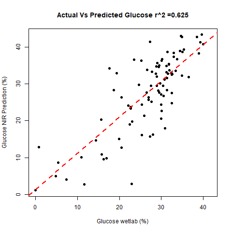
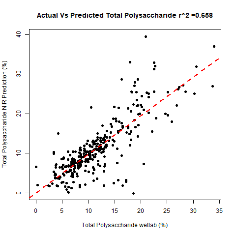

```{r setup, include=FALSE}
knitr::opts_chunk$set(echo = FALSE)
#########################
#This code was written by Lillian Hislop
#2020.02.26
#WSMDP Carbohydrate Analysis 
#########################

####What this code hopes to accomplish:
#exploratory work, look for outlines
#visualized data, scatter plot matrix
#output the line names for all the NIR samples, 
#GET gBS DATA for all the nir sample lines
#Anova for the lines
#Do a PCA for all the samples GBS data 
#Run GWAS


#########################
###Establish Workspace###
#########################
#begin by establishing a new fresh work space
rm(list=ls())
library(dplyr)
library(lme4)
library(ggplot2)#for making pretty graphs
library(ggpmisc)
library(grDevices)
library(tidyr) #for separate
library(stringr)#str_remove
library(psych)
library(reshape2)#for multiple groups in GGplot
library(outliers)
library(lattice)
library(PopGenome)
# BiocManager::install("VariantAnnotation")
library("VariantAnnotation")
library("snpStats")
library("compiler") #needed to make GAPIT work
source("http://zzlab.net/GAPIT/gapit_functions.txt")
source("http://zzlab.net/FarmCPU/FarmCPU_functions.txt")
# library("bigmemory") #to make a matrix big
# library(rrBLUP)
library(kableExtra)

getwd()
setwd("C:/Users/LHislop/Documents/GitHub/WSMDP_Carb")

#Read in packages made for these codesets
source("R/CarbEquationComparison.R")
source("R/PredictionCulling.R")
source("R/MixedEndoEqnValidation.R")
source("R/AgPredOutput.R")
source("R/CarbOutlierCleanup.R")
source("R/CarbDataFrameVis.R")


#Read in the sample information.
#this file containes the year, location,variety and endosperm of every sample
SampleInfo <- read.csv("Data/WSMDP_2014-2015_WINY_SampleInfo.csv")
#Fix the sample numbers that are labeled in the NY style e.g " 14A0255" or "15A0005" and change to just the row numbers
SampleInfo$Row <- SampleInfo$Sample.Number
SampleInfo$Row[which(nchar(SampleInfo$Row)>6)] <- substr(SampleInfo$Row[which(nchar(SampleInfo$Row)>6)],4,15)
tail(SampleInfo)
#Generate NIR Code. NIR codes are all YearLocationRow - Rep
SampleInfo$NIRBase <- paste(substr(SampleInfo$year,3,4), ifelse(SampleInfo$location == "Wisconsin", "W","NY"), SampleInfo$Row,sep = "")
tail(SampleInfo)
summary.factor(SampleInfo$endo)
length(unique(SampleInfo$Variety))

#########Read in the output from NIR##########
####Copied pasted and modified from Hislop_carb_eqn_validation.R
#6 files types. The starch and sugar predictions and the equations made by calibrating with only high wsp lines, high wsp var sug, high wsp high sug
CarbCombos <- c("hwspsu","hwspst","lwspwfsu","lwspwfst","lwspnfsu","lwspwfst")

#establish DF to hold the file readins 
CarbDF <- list()

#iterate throught the 5 file types and read them in. skip the first 9 lines which are all file descriptors, no the data
for(i in 1:6){CarbDF[[i]] <- read.csv(paste("Data/RawData/wsmdp",CarbCombos[i],"pls_predA-G.txt",sep = ""), skip = 9)}

########now match up these predicted values with the sample info and mash it all up into one########
#combine the starch and sugar files for each equation type. Condense takes all the repeated scans of the same sample and averages them
HWSPsDF <- AgPredOutput(StarchDF = CarbDF[[1]], SugDF = CarbDF[[2]], condense = TRUE)
LWSPWFsDF <- AgPredOutput(StarchDF = CarbDF[[3]], SugDF = CarbDF[[4]], condense = TRUE)
LWSPNFDF <- AgPredOutput(StarchDF = CarbDF[[5]], SugDF = CarbDF[[6]], condense = TRUE)

#Add the endosperm and variety info from the SampleInfo DF to each DF
HWSPsDF$endo <- SampleInfo$endo[match(HWSPsDF$NIRBase, SampleInfo$NIRBase, nomatch = NA)]
HWSPsDF$Variety <- SampleInfo$Variety[match(HWSPsDF$NIRBase, SampleInfo$NIRBase, nomatch = NA)]
LWSPWFsDF$endo <- SampleInfo$endo[match(LWSPWFsDF$NIRBase, SampleInfo$NIRBase, nomatch = NA)]
LWSPWFsDF$Variety <- SampleInfo$Variety[match(LWSPWFsDF$NIRBase, SampleInfo$NIRBase, nomatch = NA)]
LWSPNFDF$endo <- SampleInfo$endo[match(LWSPNFDF$NIRBase, SampleInfo$NIRBase, nomatch = NA)]
LWSPNFDF$Variety <- SampleInfo$Variety[match(LWSPNFDF$NIRBase, SampleInfo$NIRBase, nomatch = NA)]

#Eliminate irrelivant endosperm mutants from each df. We don't want to include sh2 samples that were predicted by the HWSP calibrated equations
#should sh2i samples be estimated by the sh2 calibrated equations or the other calibrated equation?
HWSPs <- HWSPsDF[which(HWSPsDF$endo == "su1" | HWSPsDF$endo == "se" | (is.na(HWSPsDF$endo)& (HWSPsDF$Year== "15"|HWSPsDF$Year == "14"))),]
# HWSPs <- HWSPsDF[which(HWSPsDF$endo == "su1" | HWSPsDF$endo == "se" | is.na(HWSPsDF$endo)),]
LWSPWFs <- LWSPWFsDF[which(LWSPNFDF$endo != "se" & LWSPNFDF$endo != "su1"),]
LWSPNFs <- LWSPNFDF[which(LWSPNFDF$endo == "sh2" | LWSPNFDF$endo == "sh2i"),]

#lets look at the validation data that I predicted from kahtleen and Jareds data and output it for further analysis
jared <- HWSPsDF[which(HWSPsDF$Year == "sc"),]
write.csv(jared, file = "Data/OutputtedData/JaredsPredictedLineswHWSPeqn.csv")
kathleen <- HWSPsDF[which(HWSPsDF$Year != "13"&HWSPsDF$Year != "14"&HWSPsDF$Year != "15"&HWSPsDF$Year != "sc"),]
write.csv(kathleen,file = "Data/OutputtedData/KathleenPredictedLineswHWSPeqn.csv")

########mash it all together ######
#All the predictions with the field lines
CarbInfoExpandedWFDF <- rbind(HWSPs,LWSPWFs)
#all the predictions without the field lines
CarbInfoExpandedNFDF <- rbind(HWSPs,LWSPNFs)

#add in a year/location environment factor
CarbInfoExpandedWFDF$Envi <- paste(CarbInfoExpandedWFDF$Year,CarbInfoExpandedWFDF$Location)
CarbInfoExpandedNFDF$Envi <- paste(CarbInfoExpandedNFDF$Year,CarbInfoExpandedNFDF$Location)

#visualize these data sets pre cleaning
CarbDataFrameVis(CarbInfoExpandedWFDF,"WithField_WithOutliers")
CarbDataFrameVis(CarbInfoExpandedNFDF,"NoField_WithOutliers")

#clean up the predictive data frames. Reassign or delete outliers 
CleanedInfoWF <- CarbOutlierCleanup(CarbInfoExpandedWFDF,"WF",alpha = 0.05)
CleanedInfoNF <- CarbOutlierCleanup(CarbInfoExpandedNFDF,"NF",alpha = 0.05)

#revisualize the dataframes 
CarbDataFrameVis(CleanedInfoWF,"WithField_Cleaned")
CarbDataFrameVis(CleanedInfoNF,"NoField_Cleaned")

#write the names of the varieties used to a csv file so we can find the corresponding GBS data
write.csv(file = "Data/OutputtedData/InbredsWithinWSMDPCarbDataNF.csv",unique(CleanedInfoNF[c("Variety", "endo")]))
write.csv(file = "Data/OutputtedData/InbredsWithinWSMDPCarbDataWF.csv",unique(CleanedInfoWF[c("Variety", "endo")]))


#######Equation Validation!##############
#Now I have a variable that has all the projected values, for the values used to calibrate the equations. WHat are the statistics on that?
#set carb to a number 1:7. carb <- c(Fructose, Glucose, Sucrose, Total Sugar, Starch, Total Polysaccharide, WSP)
#this functions needs to have the data frame set up so the carbs being compared are directly next to eachother 
EqnStats <- function(DF){
  
  #establish dataframe used to record stats
  Out <- data.frame(Carb = c("Fructose", "Glucose", "Sucrose", "Total Sugar", "Starch", "Total Polysaccharide", "WSP"),
                    RMSEP = rep(NA,7), 
                    bias = rep(NA,7),
                    SEE = rep(NA,7),
                    slope = rep(NA,7),
                    intercept = rep(NA,7),
                    R2 = rep(NA,7))
  dfpos <- c(2,4,6,8,10,12,14)
  for(carb in 1:7){
    #Calculated the RMSEP
    Out$RMSEP[carb] <- sqrt(sum((DF[,dfpos[carb]]- DF[,dfpos[carb]-1])^2, na.rm = TRUE)/dim(DF)[1])
    #Calculate the Bias
    Out$bias[carb] <- mean(DF[,dfpos[carb]], na.rm = TRUE) - mean(DF[,dfpos[carb]-1],na.rm = TRUE)
    #Calculated the SEE
    Out$SEE[carb] <- sqrt((dim(DF)[1]/(dim(DF)[1]-1))*(Out$RMSEP[carb]^2-Out$bias[carb]^2))
    Out$Carb[carb] <- colnames(DF[dfpos[carb]])
  }
  return(Out)
}


#Visualize these
R2Vis <- function(DF, label, Out){
  dfpos <- c(2,4,6,8,10,12,14)
  Carb = c("Fructose", "Glucose", "Sucrose", "Total Sugar", "Starch", "Total Polysaccharide", "WSP")
  for(i in 1:7){
    carbCompare  <- lm(DF[,dfpos[i]]~ DF[,dfpos[i]-1])
    carbFileName <- paste("Figures/wsmdp2021_",label,Carb[i],"_NIR_Eqn_Prediction_vis.png", sep = "")
    png(carbFileName)
    par(mfrow=c(1,1))
    print(summary(carbCompare))
    rsqua <- summary(carbCompare)$r.squared
    plot(DF[,dfpos[i]]~ DF[,dfpos[i]-1],
         pch = 16,
         xlab = paste(Carb[i]," wetlab (%)",sep = ""),
         ylab = paste(Carb[i]," NIR Prediction (%)",sep = ""),
         main = paste("Actual Vs Predicted ",Carb[i]," r^2 =",trunc(rsqua*10^3)/10^3,sep = ""))
    abline(coefficients(carbCompare), lwd = 2, lty = 2, col = "red")
    # text(15,max(Prediction[,i])-5,labels = paste("r^2 =",trunc(rsqua*10^3)/10^3))
    
    Out$slope[i] <- trunc(10^3*summary(carbCompare)$coefficients[2])/10^3
    Out$intercept[i] <- trunc(10^3*summary(carbCompare)$coefficients[1])/10^3
    Out$R2[i] <- trunc(10^3*summary(carbCompare)$r.squared)/10^3
    
    
    dev.off()
  }
  return(Out)
}


######Visualize the validation. Look at all the samples that were wetlabbed and used to calibrate the equation
wetlabDF <- read.csv("Data/WSMDP_Wetlab_StarchSugarData_FormatedForWinISI_WithR.csv")
colnames(wetlabDF)[1] <- "Samples"
WFWL <- merge(CleanedInfoWF, wetlabDF, by = "Samples")
NFWL <- merge(CleanedInfoNF, wetlabDF, by = "Samples")
WFWLdf <- WFWL[,c(1,9,18,8,19,10,20,11,21,5,22,6,23,7,24)]
NFWLdf <- NFWL[,c(1,9,18,8,19,10,20,11,21,5,22,6,23,7,24)]
WFWLdfEqnStatsR <- R2Vis(WFWLdf[,2:15], "CleanedWSPeqnWF_PredVsWetlab_for_Calibration_Samples", EqnStats(WFWLdf[,2:15]))
NFWLdfEqnStatsR <- R2Vis(NFWLdf[,2:15], "CleanedWSPeqnNF_PredVsWetlab_for_Calibration_Samples", EqnStats(NFWLdf[,2:15]))

write.csv(WFWLdfEqnStatsR, "Data/OutputtedData/EqnFitStatisticsAllWetlabWF.csv")
write.csv(NFWLdfEqnStatsR, "Data/OutputtedData/EqnFitStatisticsAllWetlabNF.csv")

######Visualize the validation. Only the samples that were NOT used to create the equation
valwetlabDF <- read.csv("Data/WSMDP_EqnValidation_Wetlab_Data.csv")
colnames(valwetlabDF)[1] <- "Samples"
WFValWL <- merge(CleanedInfoWF, valwetlabDF, by = "Samples")
NFValWL <- merge(CleanedInfoNF, valwetlabDF, by = "Samples")
WFValWLdf <- WFValWL[,c(1,9,23,8,22,10,24,11,25,5,19,6,20,7,21)]
NFValWLdf <- NFValWL[,c(1,9,23,8,22,10,24,11,25,5,19,6,20,7,21)]
WFValWLdfEqnStatsR <- R2Vis(WFValWLdf[,2:15], "CleanedWSPeqnWF_PredVsWetlab_ValidationSubset", EqnStats(WFValWLdf[,2:15]))
NFValWLdfEqnStatsR <- R2Vis(NFValWLdf[,2:15], "CleanedWSPeqnNF_PredVsWetlab_ValidationSubset", EqnStats(NFValWLdf[,2:15]))

write.csv(WFValWLdfEqnStatsR, "Data/OutputtedData/EqnFitStatisticsValidationWF.csv")
write.csv(NFValWLdfEqnStatsR, "Data/OutputtedData/EqnFitStatisticsValidationNF.csv")


####With Jared WetlabDATA
HWSPsJ <- HWSPsDF[which(HWSPsDF$endo == "su1" | HWSPsDF$endo == "se" | is.na(HWSPsDF$endo)),]
CarbInfoExpandedWFJDF <- rbind(HWSPsJ,LWSPWFs)
CarbInfoExpandedNFJDF <- rbind(HWSPsJ,LWSPNFs)
WFValWLJ <- merge(CarbInfoExpandedWFJDF, valwetlabDF, by = "Samples")
NFValWLJ <- merge(CarbInfoExpandedNFJDF, valwetlabDF, by = "Samples")
WFValWLJdf <- WFValWLJ[,c(1,9,21,8,20,10,22,11,23,5,17,6,18,7,19)]
NFValWLJdf <- NFValWLJ[,c(1,9,21,8,20,10,22,11,23,5,17,6,18,7,19)]
WFValWLdfJEqnStatsR <- R2Vis(WFValWLJdf[,2:15], "UnCleanedWSPeqnWF_PredVsWetlab_ValidationSubset_WJared", EqnStats(WFValWLdf[,2:15]))
NFValWLdfJEqnStatsR <- R2Vis(NFValWLJdf[,2:15], "UnCleanedWSPeqnNF_PredVsWetlab_ValidationSubset_WJared", EqnStats(NFValWLdf[,2:15]))

write.csv(WFValWLdfJEqnStatsR, "Data/OutputtedData/EqnFitStatisticsValidationWF_WJared.csv")
write.csv(NFValWLdfJEqnStatsR, "Data/OutputtedData/EqnFitStatisticsValidationNF_WJared.csv")


```

## Carbohydrate Research Analysis Update    

- Recreated NIR Calibration equations with two pools 
    - High WSP pool (*su1* and *se*)
    - Low WSP pool
        - With Field inbreds (*sh2*, *sh2i*, field, *aeduwx*)
        - No Field inbreds (*sh2* and *sh2i* only in both calibration and prediction)
- Preliminary Statistical Analysis
    - Heritability
    - Linear Modeling
- GWAS with GAPIT

## Equation Quality

``` {r}
r2sum <- data.frame(cbind(WFWLdfEqnStatsR$R2, WFValWLdfEqnStatsR$R2,WFValWLdfJEqnStatsR$R2, NFWLdfEqnStatsR$R2, NFValWLdfEqnStatsR$R2, NFValWLdfJEqnStatsR$R2))
r2sum<- (r2sum %>%
  bind_rows(summarise_all(., ~if(is.numeric(.)) mean(.) else "Total")))
rownames(r2sum) <- c("Fructose", "Glucose", "Sucrose", "Total Sugar", "Starch", "Total Polysaccharide", "WSP", "Average R^2")
colnames(r2sum) <- c("WF All Wetlab Samples","WF Validation Wetlab Samples","WF Validation Wetlab and Zystro Samples","NF All Wetlab Samples","NF Validaion Wetlab Samples","NF Validation Wetlab and Zystro Samples" )

knitr::kable(r2sum, digits = 3) %>%
row_spec(8, bold = T, color = "white", background = "#D7261E")
```

## Total Wetlab Samples


## Only WSMDP Validation Samples


## WSMDP and Zystro Validation Samples


## Total Wetlab Samples


## Only WSMDP Validation Samples


## WSMDP and Zystro Validation Samples


## WF Group: Cleaned Predicted Carbohydrates


## NF Group: Cleaned Predicted Carbohydrates


## WF Group: Sugars By Endosperm
{width=90%}

## WF Group: Sugars By Endosperm


## Trait Quality and Heritability
```{r, echo=FALSE}

h2 <- read.csv(file = "../Data/OutputtedData/h2_ALLCarb.txt", header = TRUE)
h2Verb <- data.frame(h2$Carb,paste0(round(h2$mean,2)," +/- ",round(h2$SD,2)), paste0(round(h2$min,2),"-",round(h2$max,2)),round(h2$h2,2))
colnames(h2Verb) <- c("Carbohydrate", "Mean(%)+/-SD","Range(%)","h^2")
knitr::kable(h2Verb) %>%
  kable_styling(bootstrap_options = "striped", full_width = T) 
```

## Linear Model


## WF Group: GAPIT
```{r image-ref-for-in-text, echo = FALSE, message=FALSE, fig.align='center', fig.cap='Total Poly Genomewise', out.width='0.75\\linewidth', fig.pos='H'}
setwd("C:/Users/LHislop/Documents/GitHub/WSMDP_Carb/R")
knitr::include_graphics("GAPIT/WF/GAPITMLMMTotalPolysaccharidesManhattanPlotGenomewise.pdf")
```

## WF Group: GAPIT
```{r fig.align='center', fig.cap='Total Poly Genomewise'}
knitr::include_graphics("GAPIT/WF/GAPIT_MLMM_Sugar_Test.pdf")
```

## WF Group: GAPIT

<!--  -->

## WF Group: GAPIT
```{r label, out.width = "85%", fig.cap = "caption"}
setwd("C:/Users/LHislop/Documents/GitHub/WSMDP_Carb/R")
knitr::include_graphics("../Data/OutputtedData/GAPIT/WF/GAPIT.MLMM.Total.Polysaccharides.Manhattan.Plot.Genomewise.pdf")
```
## WF Group: GAPIT


## WF Group: GAPIT

## WF Group: GAPIT


## WF Group: GAPIT


## HWSP Group: GAPIT


## HWSP Group: GAPIT


## HWSP Group: GAPIT


## HWSP Group: GAPIT


## HWSP Group: GAPIT


## HWSP Group: GAPIT


## HWSP Group: GAPIT
